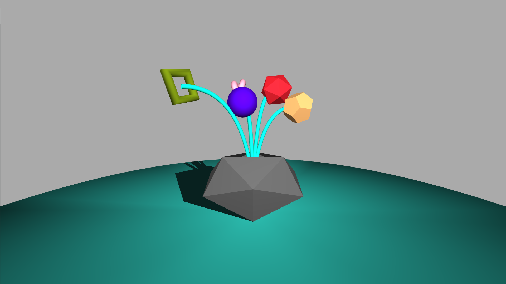

# three.js-sketches

My three.js sketches

<!-- Generated by mktos.sh -->

<table>
    <tr>
        <td align="center">
             
            <a href="creative-flower-pot/">creative-flower-pot</a>
        </td>
        <td align="center">
             
            <a href="reflective-torus-knot/">reflective-torus-knot</a>
        </td>
        <td align="center">
             
            <a href="woolen-balls/">woolen-balls</a>
        </td>
    </tr>
</table>
