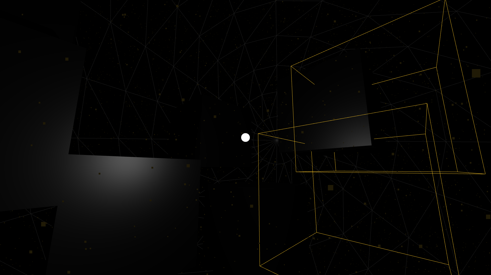

# My three.js sketches

[website]: https://you-create.github.io/three.js-sketches

This repository contains my [three.js](https://threejs.org) sketches; basically,
anything I have created with the library that I find cool! They are all
displayed on :point_right: [this website][website] :point_left:.

## :star: Highlights

[**Visit the website**][website] to see all of my sketches! Here are just a 
selected few.

<table>
    <tr>
        <td style="text-align: center">
            
        </td>
        <td style="text-align: left">
            A metaphysical space that evokes emotions to complement with
            solitude and depression.
        </td>
    </tr>
    <tr>
        <td style="text-align: center">
            
        </td>
        <td style="text-align: left">
            Some gigantic donuts on a wall, literally.
        </td>
    </tr>
    <tr>
        <td style="text-align: center">
            
        </td>
        <td style="text-align: left">
            A 3D version of the creative flower pot that I gave to one of my
            beloved teacher as a gift on Vietnamese Teachers' Day 2019.
        </td>
    </tr>
</table>

## :open_file_folder: Directory structure

- `sketches/`: My three.js sketches, one for each sub-directory
- `assets/`: Contains shared CSS files, fonts, textures, images, etc.
- `three.js/`: A portion of the three.js repository needed by the sketches
- `lib/`: Contains other shared libraries, frameworks, and JavaScript files
- `common/`: Contains templates
- `_data/`, `_layouts/`, `_posts`, `_config.yml`, `index.md`, `Gemfile`,
  `Gemfile.lock`: Directories and files that you know very well if you've ever
  worked with a Jekyll website
- `README.md`: The document you are reading
- The rest of the files at the root directory: Various configuration files used
  by Git, NPM, and what not

## :page_with_curl: Copyright

### Code

[no-lic]: https://choosealicense.com/no-permission/

Copyright :copyright: 2019 by Nguyen Hoang Duong (<you_create@protonmail.com>).

Currently the source code is not licensed and is meant for educational purposes.
See [this page][no-lic] by GitHub to know what you are supposed to do. However,
I'm considering a Creative Commons license, and I will make my final decision
as soon as possible. You can suggest a better license for this project by
opening a new issue.

### Textures

One or more textures used in this project have been created with photographs
from Textures.com. These photographs may not be redistributed by default;
please visit www.textures.com for more information.

Some textures are made by Emil Persson (a.k.a. Humus). Those textures are
licensed under the Creative Commons Attribution 3.0 Unported license.

There are also textures from other authors. The _Acknowledgements_ section of a
sketch's README file provides detailed information about who owns the textures
used by the sketch as well as licensing information.
