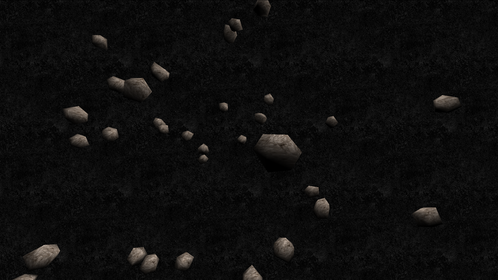

# spaceship

This serves as a template for sketches' READMEs. The header above should be the
sketch's name, which is named after the directory containing it. This section
should describe what the sketch is about.

There are also 3 optional sections, which should appear in the following order:

1. **Interaction**: describes how the viewer can interact with the sketch
2. **To-do's**: to-do's and fixes for coders
3. **Acknowledgements**: acknowledgements and thanks due to the people who own
   or made the assets (e.g. textures, models) used by the sketch, also links to
   their portfolios/homepages and licensing information

Below is the sketch's preview.

## Interaction

- Drag your left mouse to orbit all the things! (`OrbitControls`)
- Hit your spacebar to toggle between views

## To-do's

- [x] Simulate gravity
- [x] Add background stars
- [ ] Add planets
- [ ] Add some satelites
- [ ] Use high-res textures

## Acknowledgements

[link]: https://codepen.io/rachsmith/

Thanks are due to [Rachel Smith][link] for the three.js scene screenshotted
above.
