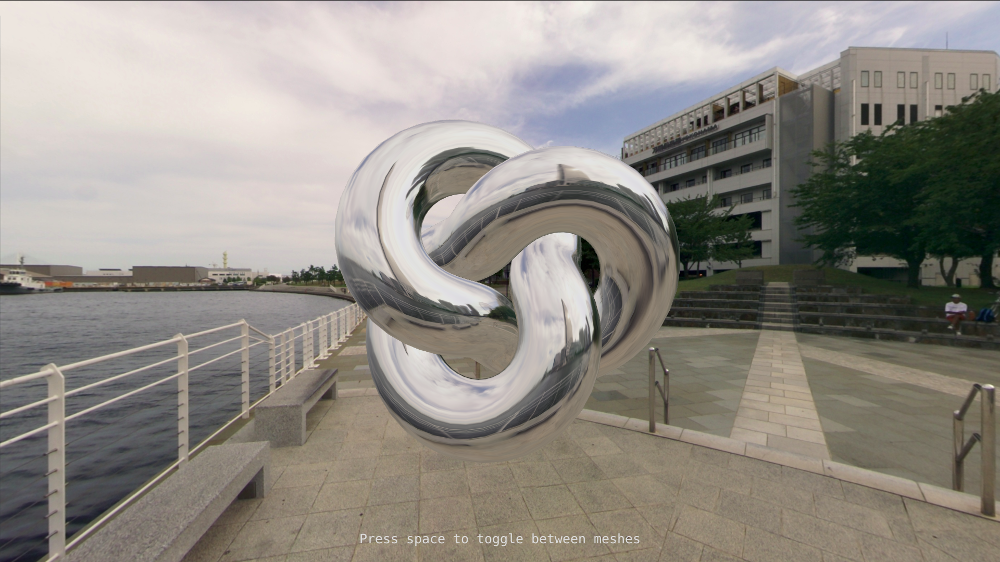

# reflective-torus-knot

What I made while learning the very basics of cube mapping in three.js. It's
not really something that I would call a sketch, I just thought it was nice.

## Interaction

- Drag your left mouse to orbit around the mesh
- Press the spacebar on your keyboard to switch between a reflective mesh and a
  refractive mesh

## Acknowledgements

[yokohama]: http://www.humus.name/index.php?page=Textures&ID=137

Cube map [_Yokohama_][yokohama] by [Emil Persson](http://www.humus.name)
licensed under the Creative Commons Attribution 3.0 Unported license.
