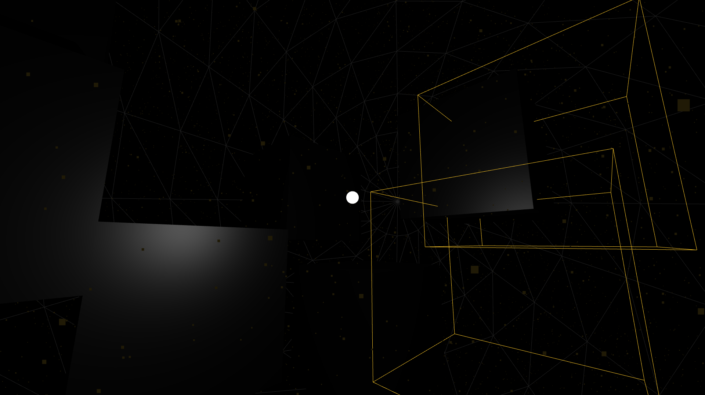

# singularity

**_singularity_** is a little space I have made for all of the people feeling
lonely or hopeless out there to sink in. I don't expect it to really cure
people's negative feelings, but I wanted it to evoke a certain complementary 
emotion that such people would be comfortable to adhere, and this was what I
came up with. It is not the best, but I had fun making this piece, and I hope
you will enjoy it.

## Interaction

- Left click your mouse to toggle between 2 light sources: one is from the
Singularity, if you are waiting for Hope to come, and one is from the spot
light, which is controlled by **you**.
- Right click and drag to pan around the view

## To-do's

- [ ] Display a short message at the beginning
- [ ] Singularity: Accurately animate the material when the light gains power
      at the beginning
- [x] Display the box helpers more prominently
- [x] Display the background wireframe sphere more prominently without
      significantly affect the overall view
- [ ] Randomize monoliths' size
- [ ] Better ambient music?

## Acknowledgements

Music: _The Light_ by [ProductionCrate](https://productioncrate.com).
