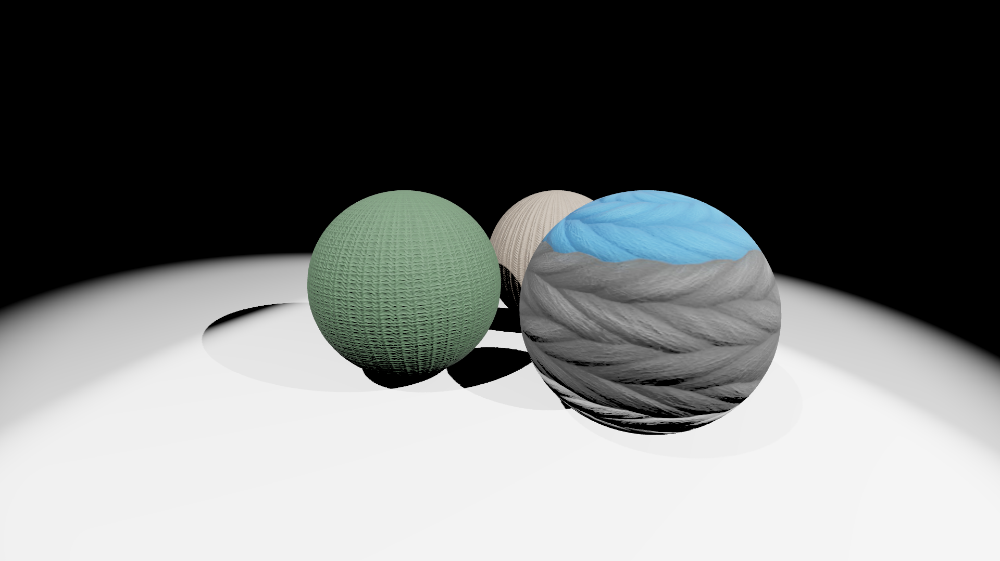

# woolen-balls

Some woolen balls on a porcelain floor that I've created. Lights are (hopefully)
physically correct. Woolen balls look peacefully perhaps.

## To-do's

- [x] Physically correct lights
- [ ] Even more physically correct lights (they don't look right currently)
- [ ] Find better textures (currently-used textures look broken)
- [ ] Find a better material for the floor (?)

## Acknowledgements

[texture-01]: ../../assets/textures/wool-01
[texture-02]: ../../assets/textures/wool-02
[texture-03]: ../../assets/textures/wool-03
[matcap]: ../../assets/textures/porcelain-white
[milos]: https://milosparipovic.com

- Textures of wools (can be found [here][texture-01], [here][texture-02], and
  [here][texture-03]) are from Textures.com
- [White porcelain matcap][matcap] courtesy of [Milos Paripovic][milos]
